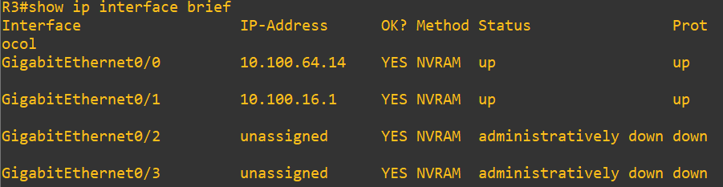
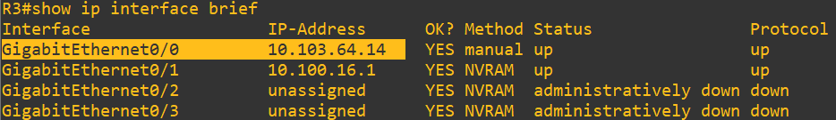
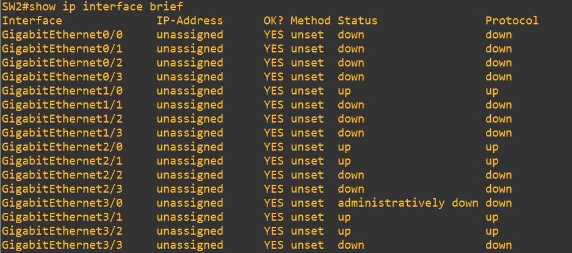
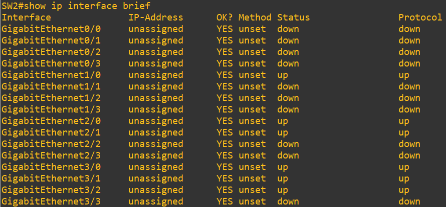
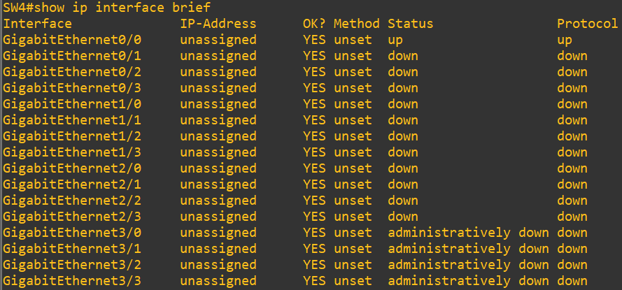

## HF – NW2 GNS3 Labor 1

## Vorgehen

Allgemeines Vorgehen, von Edge1 rückwerts verscuht IP und Hostname Ping
 

## Core1

Vieleicht Flasch

                ip dns set servers=8.8.8.8,8.8.4.4 allow-remote-requests=yes max-udp-packet-size=4096 query-server-timeout=2.000 query-total-timeout=10.000 cache-size=2048 cache-max-ttl=7d

## R1

Ping funktioniert nicht. Routing erstellt

                 ip route/add dst-address=0.0.0.0/0 gateway=10.103.64.5

## R2

Port em0 Ip Angepasst, auf 10.103.64.10/30

Port em1 Ip Angepasst, auf 10.103.8.1/21 mit DHCP Aktiv von 10.103.8.2 - 10.103.15.254

## Analyse R3

Status der Interfaces abrufen

                show ip interface brief

In Admin Modus wechseln mit:

                en

Konfiguration aufrufen und mit "t" den Terminal-Modus auswählen.

                conf t

Interface 0/0 auswählen

                interface g0/0

IP Adresse des Interfaces angepasst

                ip address 10.103.64.14 255.255.255.252

Vorgenommene Konfiguration überprüfen

                show ip interface brief

IP Route erfasse

                ip route 0.0.0.0 0.0.0.0 10.103.64.13

alte IP Route erfasse

                no ip route 0.0.0.0 0.0.0.0 10.100.64.13

copy
## Analyse SW1

### Vlan zu fehlenden Ports hinzufügen

Dies wurde für die Ports g3/0, g3/1, g3/2 angepasst

                R1# configure terminal
                R1(config)# interface g3/1
                R1(config-if)# switchport mode access
                R1(config-if)# switchport access vlan 10
                R1(config-if)# exit
                R1(config)# write memory

## Analyse SW2

### Vlan zu fehlenden Ports hinzufügen

Dies wurde für die Ports g3/3, g3/1, g3/2 angepasst

                R1# configure terminal
                R1(config)# interface g3/1
                R1(config-if)# switchport mode access
                R1(config-if)# switchport access vlan 10
                R1(config-if)# exit
                R1(config)# write memory

### Interface Starten

Status der Switch-Ports abrufen um zu schauen welche Ports den Status "Down" haben.

                show ip interface brief

In Admin Modus wechseln mit:

                en

Konfiguration aufrufen und mit "t" den Terminal-Modus auswählen.

                conf t

Interface 3/0 auswählen

                interface g3/0

Port Starten

                no shut

Vorgenommene Konfiguration überprüfen

Geänderte Configuration speichern, damit nicht bei einem Neustart alles neu konfiguriert werden muss 

                copy running-config startup-config

## Analyse SW3

### Spanning Tree Deaktivierung

In Admin Modus wechseln: 

                en
                

In die Konfig wechseln: 

                conf t
                

In jeweiligen Port wechseln (wir haben spanning tree bei den Ports g3/0 - g3/3 deaktiviert): 

                g3/1
                

Spanning-Tree Deaktivieren: 

                no spanning-tree portfast edge

 

## Analyse SW4

### Vlan zu fehlenden Ports hinzufügen

Dies wurde für die Ports g3/3, g3/1, g3/2 angepasst

                R1# configure terminal
                R1(config)# interface g3/1
                R1(config-if)# switchport mode access
                R1(config-if)# switchport access vlan 10
                R1(config-if)# exit
                R1(config)# write memory

 Status der Switch-Ports abrufen um zu schauen welche Ports den Status "Down" haben.

                show ip interface brief

In Admin Modus wechseln mit:

                en

Konfiguration aufrufen und mit "t" den Terminal-Modus auswählen.

                conf t

Interface 3/0 auswählen

                interface g3/0

Port Starten

                no shut

Interface 3/1 auswählen

                interface g3/1

Port Starten

                no shut

Interface 3/2 auswählen

                interface g3/2

Port Starten

                no shut

Interface 3/3 auswählen

                interface g3/3

Port Starten

                no shut
                

Vorgenommene Konfiguration überprüfen

Geänderte Configuration speichern, damit nicht bei einem Neustart alles neu konfiguriert werden muss 

                copy running-config startup-config
